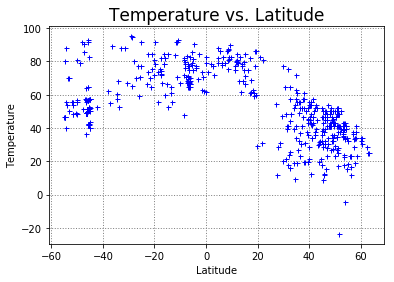
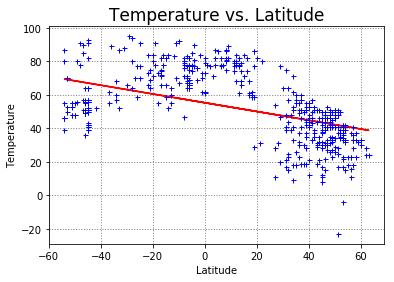
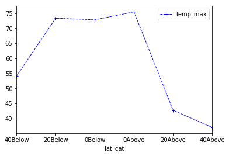
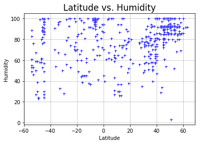
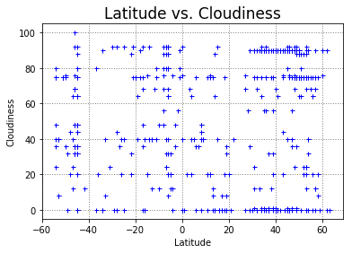
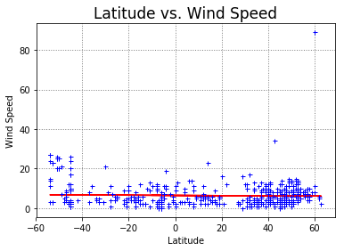

# Dependents
***


```python
import requests as req
import json
import time
import numpy as np
import pandas as pd
import matplotlib.pyplot as plt
from scipy import stats
from requests.exceptions import HTTPError
```

# Loading the data from CSV file
***


```python
city_data = 'citycountry_latlon.csv'
city_data_df = pd.read_csv(city_data, encoding = 'ISO-8859-1')
```

    /Users/jeffmoore/anaconda3/lib/python3.6/site-packages/IPython/core/interactiveshell.py:2698: DtypeWarning: Columns (3) have mixed types. Specify dtype option on import or set low_memory=False.
      interactivity=interactivity, compiler=compiler, result=result)


```python
# Creating a dataframe to store or process the data
# The issue is that citipy or the raw data contain far more records than the openweather database
# (3100000 vs 200000 cities) so some work is needed to find a suitable list of cities.
# I elected to divide the dataset into 4 groups.  This will ensure full coverage across the dataset.
city_data_df = city_data_df[['Country', 'City', 'Latitude']]
city_data_upper45_df = city_data_df[city_data_df['Latitude'] > 45]
city_data_ubt045_df = city_data_df[city_data_df['Latitude'] <= 45]
city_data_ubt045_df = city_data_ubt045_df[city_data_ubt045_df['Latitude'] > 0]
city_data_lbt045_df = city_data_df[city_data_df['Latitude'] < 0]
city_data_lbt045_df = city_data_lbt045_df[city_data_lbt045_df['Latitude'] >= -45]
city_data_lower45_df = city_data_df[city_data_df['Latitude'] < -45]
```


```python
# Building a dataframe to store the results of the URL requests
city_data_df["temp_min"] = ""
city_data_df["temp_max"] = ""
city_data_df['humid'] = ''
city_data_df['wind_speed'] = ''
city_data_df['cloud'] = ''
city_data_df['found_city'] = ''
city_data_df['url'] = ''
city_does_not_exist = []
```


```python
len(city_data_df[city_data_df['found_city'] != ''])
```


    0


# Making the URL request and storing the response
***


```python
# using the URL from openweather to look at current weather information
# I considered looking at historical info but there were limitations on data availability
url = 'http://api.openweathermap.org/data/2.5/weather?q='
api_key = '2e0b3995de13957a2e62c46a5a3da34b'
mode = '&mode=json'
units = 'imperial'
```


```python
# Greater than 45 degrees latitude
while len(city_data_df[city_data_df['found_city'] != '']) < 100:
    test_cities_data_df = city_data_upper45_df.sample(125)
    time.sleep(15)
    for index, row in test_cities_data_df.iterrows():
        target_url = url + row['City'] + ',' + row['Country'] + '&APPID=' + api_key + '&units=' + units
        try:
            r = req.get(target_url)
            r.raise_for_status()
        except HTTPError:
            city_does_not_exist.append(r.url)
        else:
            hold_data = req.get(target_url).json()
            city_data_df.set_value(index, "found_city", row['City'])
            city_data_df.set_value(index, "temp_min", hold_data["main"]["temp_min"])
            city_data_df.set_value(index, "temp_max", hold_data["main"]["temp_max"])
            city_data_df.set_value(index, "humid", hold_data["main"]["humidity"])
            city_data_df.set_value(index, "wind_speed", hold_data["wind"]["speed"])
            city_data_df.set_value(index, "cloud", hold_data["clouds"]["all"])
            city_data_df.set_value(index, "url", target_url)
```


```python
len(city_data_df[city_data_df['found_city'] != ''])
```


    146


```python
# Between 0 and 45 degrees latitude
while len(city_data_df[city_data_df['found_city'] != '']) < 250:
    test_cities_data_df = city_data_ubt045_df.sample(125)
    time.sleep(15)
    for index, row in test_cities_data_df.iterrows():
        target_url = url + row['City'] + ',' + row['Country'] + '&APPID=' + api_key + '&units=' + units
        try:
            r = req.get(target_url)
            r.raise_for_status()
        except HTTPError:
            city_does_not_exist.append(r.url)
        else:
            hold_data = req.get(target_url).json()
            city_data_df.set_value(index, "found_city", row['City'])
            city_data_df.set_value(index, "temp_min", hold_data["main"]["temp_min"])
            city_data_df.set_value(index, "temp_max", hold_data["main"]["temp_max"])
            city_data_df.set_value(index, "humid", hold_data["main"]["humidity"])
            city_data_df.set_value(index, "wind_speed", hold_data["wind"]["speed"])
            city_data_df.set_value(index, "cloud", hold_data["clouds"]["all"])
            city_data_df.set_value(index, "url", target_url)
```


```python
len(city_data_df[city_data_df['found_city'] != ''])
```


    304


```python
# Between 0 and -45 degrees latitude
while len(city_data_df[city_data_df['found_city'] != '']) < 400:
    test_cities_data_df = city_data_lbt045_df.sample(125)
    time.sleep(15)
    for index, row in test_cities_data_df.iterrows():
        target_url = url + row['City'] + ',' + row['Country'] + '&APPID=' + api_key + '&units=' + units
        try:
            r = req.get(target_url)
            r.raise_for_status()
        except HTTPError:
            city_does_not_exist.append(r.url)
        else:
            hold_data = req.get(target_url).json()
            city_data_df.set_value(index, "found_city", row['City'])
            city_data_df.set_value(index, "temp_min", hold_data["main"]["temp_min"])
            city_data_df.set_value(index, "temp_max", hold_data["main"]["temp_max"])
            city_data_df.set_value(index, "humid", hold_data["main"]["humidity"])
            city_data_df.set_value(index, "wind_speed", hold_data["wind"]["speed"])
            city_data_df.set_value(index, "cloud", hold_data["clouds"]["all"])
            city_data_df.set_value(index, "url", target_url)
```


```python
len(city_data_df[city_data_df['found_city'] != ''])
```


    413


```python
# Less than -45 degrees latitudes
while len(city_data_df[city_data_df['found_city'] != '']) < 500:
    test_cities_data_df = city_data_lower45_df.sample(200)
    time.sleep(15)
    for index, row in test_cities_data_df.iterrows():
        target_url = url + row['City'] + ',' + row['Country'] + '&APPID=' + api_key + '&units=' + units
        try:
            r = req.get(target_url)
            r.raise_for_status()
        except HTTPError:
            city_does_not_exist.append(r.url)
        else:
            hold_data = req.get(target_url).json()
            city_data_df.set_value(index, "found_city", row['City'])
            city_data_df.set_value(index, "temp_min", hold_data["main"]["temp_min"])
            city_data_df.set_value(index, "temp_max", hold_data["main"]["temp_max"])
            city_data_df.set_value(index, "humid", hold_data["main"]["humidity"])
            city_data_df.set_value(index, "wind_speed", hold_data["wind"]["speed"])
            city_data_df.set_value(index, "cloud", hold_data["clouds"]["all"])
            city_data_df.set_value(index, "url", target_url)
```


```python
city_data_df[city_data_df['found_city'] != ''].to_csv('Weather_API_output.csv')
```


```python
plot_data_df = city_data_df[city_data_df['found_city'] != '']
len(plot_data_df)
```


    519


```python
# Creating bins to segment the data and to plot the averages vs. latitude
lat_bins = [-60,-40,-20,0,20,40,60]
group_names = ['40Below', '20Below', '0Below', '0Above', '20Above', '40Above']
plot_data_df['lat_cat'] = pd.cut(plot_data_df['Latitude'], bins=lat_bins, labels=group_names)
plot_data_df.head()
```

    /Users/jeffmoore/anaconda3/lib/python3.6/site-packages/ipykernel_launcher.py:4: SettingWithCopyWarning: 
    A value is trying to be set on a copy of a slice from a DataFrame.
    Try using .loc[row_indexer,col_indexer] = value instead
    
    See the caveats in the documentation: http://pandas.pydata.org/pandas-docs/stable/indexing.html#indexing-view-versus-copy
      after removing the cwd from sys.path.


<div>
<style>
    .dataframe thead tr:only-child th {
        text-align: right;
    }

    .dataframe thead th {
        text-align: left;
    }

    .dataframe tbody tr th {
        vertical-align: top;
    }
</style>
<table border="1" class="dataframe">
  <thead>
    <tr style="text-align: right;">
      <th></th>
      <th>Country</th>
      <th>City</th>
      <th>Latitude</th>
      <th>temp_min</th>
      <th>temp_max</th>
      <th>humid</th>
      <th>wind_speed</th>
      <th>cloud</th>
      <th>found_city</th>
      <th>url</th>
      <th>lat_cat</th>
    </tr>
  </thead>
  <tbody>
    <tr>
      <th>61107</th>
      <td>af</td>
      <td>qal`ah-ye sang-e takht</td>
      <td>34.259067</td>
      <td>18.7</td>
      <td>18.7</td>
      <td>76</td>
      <td>2.04</td>
      <td>64</td>
      <td>qal`ah-ye sang-e takht</td>
      <td>http://api.openweathermap.org/data/2.5/weather...</td>
      <td>20Above</td>
    </tr>
    <tr>
      <th>86964</th>
      <td>af</td>
      <td>wurjani</td>
      <td>32.428812</td>
      <td>25.77</td>
      <td>25.77</td>
      <td>74</td>
      <td>2.04</td>
      <td>0</td>
      <td>wurjani</td>
      <td>http://api.openweathermap.org/data/2.5/weather...</td>
      <td>20Above</td>
    </tr>
    <tr>
      <th>127447</th>
      <td>ar</td>
      <td>aguada grande</td>
      <td>-47.389004</td>
      <td>85.98</td>
      <td>85.98</td>
      <td>61</td>
      <td>4.38</td>
      <td>24</td>
      <td>aguada grande</td>
      <td>http://api.openweathermap.org/data/2.5/weather...</td>
      <td>40Below</td>
    </tr>
    <tr>
      <th>127650</th>
      <td>ar</td>
      <td>alto rio senguer</td>
      <td>-45.041049</td>
      <td>50.43</td>
      <td>50.43</td>
      <td>40</td>
      <td>26.75</td>
      <td>0</td>
      <td>alto rio senguer</td>
      <td>http://api.openweathermap.org/data/2.5/weather...</td>
      <td>40Below</td>
    </tr>
    <tr>
      <th>127772</th>
      <td>ar</td>
      <td>antonio pini</td>
      <td>-29.075481</td>
      <td>95.16</td>
      <td>95.16</td>
      <td>66</td>
      <td>8.41</td>
      <td>0</td>
      <td>antonio pini</td>
      <td>http://api.openweathermap.org/data/2.5/weather...</td>
      <td>20Below</td>
    </tr>
  </tbody>
</table>
</div>


# Plotting the data
***


```python
# Plot of temperature vs. Latitude
x = plot_data_df['Latitude']
y = plot_data_df['temp_max']
plt.plot(x, y, marker='+', color='blue', markersize=5, linewidth=.1, linestyle='None')
plt.grid(True, color='gray', linestyle=':', linewidth=1)
plt.ylabel("Temperature", size=10)
plt.xlabel("Latitude", size=10)
plt.title('Temperature vs. Latitude', size=17)
plt.show()
```





```python
# floats and strings are tough to work with. Need to change those to integers
plot_data_df.dtypes
```


    Country         object
    City            object
    Latitude       float64
    temp_min        object
    temp_max        object
    humid           object
    wind_speed      object
    cloud           object
    found_city      object
    url             object
    lat_cat       category
    dtype: object


```python
# Changing the columns to be numeric so that we can do some basic stats
plot_data_df = plot_data_df.astype({'Latitude':int})
plot_data_df = plot_data_df.astype({'temp_max':int})
plot_data_df = plot_data_df.astype({'wind_speed':int})
plot_data_df.dtypes
```


    Country         object
    City            object
    Latitude         int64
    temp_min        object
    temp_max         int64
    humid           object
    wind_speed       int64
    cloud           object
    found_city      object
    url             object
    lat_cat       category
    dtype: object


```python
# Replotting the latitude vs. temperature plot and adding a regression line that shows the relationship between the 
# variables.  Notice that the southern hempishere summer is happening now while the northern hemisphere is happening
# now
x = plot_data_df['Latitude']
y = plot_data_df['temp_max']
slope, intercept, r_value, p_value, std_err = stats.linregress(x, y)
plt.plot(x, intercept + slope*x, 'r', label='fitted line')
plt.plot(x, y, marker='+', color='blue', markersize=5, linewidth=.1, linestyle='None', label='raw data')
plt.grid(True, color='gray', linestyle=':', linewidth=1)
plt.ylabel("Temperature", size=10)
plt.xlabel("Latitude", size=10)
plt.title('Temperature vs. Latitude', size=17)
plt.show()
```





```python
# Printing the line equation
print("The regression line equation is:", "y=",slope,"*x + ", intercept)
```

    The regression line equation is: y= -0.261642622064 *x +  55.3002805557


```python
# Print the p-value
print("p-value:", p_value, "and", "std error:", std_err)
```

    p-value: 2.44362584843e-34 and std error: 0.0198748764211


```python
# Showing the correlation between temp and latitude
print("r-squared:", r_value**2)
```

    r-squared: 0.251054402151


```python
group_analysis_df = plot_data_df
group_analysis_df.head()
```


<div>
<style>
    .dataframe thead tr:only-child th {
        text-align: right;
    }

    .dataframe thead th {
        text-align: left;
    }

    .dataframe tbody tr th {
        vertical-align: top;
    }
</style>
<table border="1" class="dataframe">
  <thead>
    <tr style="text-align: right;">
      <th></th>
      <th>Country</th>
      <th>City</th>
      <th>Latitude</th>
      <th>temp_min</th>
      <th>temp_max</th>
      <th>humid</th>
      <th>wind_speed</th>
      <th>cloud</th>
      <th>found_city</th>
      <th>url</th>
      <th>lat_cat</th>
    </tr>
  </thead>
  <tbody>
    <tr>
      <th>61107</th>
      <td>af</td>
      <td>qal`ah-ye sang-e takht</td>
      <td>34</td>
      <td>18.7</td>
      <td>18</td>
      <td>76</td>
      <td>2</td>
      <td>64</td>
      <td>qal`ah-ye sang-e takht</td>
      <td>http://api.openweathermap.org/data/2.5/weather...</td>
      <td>20Above</td>
    </tr>
    <tr>
      <th>86964</th>
      <td>af</td>
      <td>wurjani</td>
      <td>32</td>
      <td>25.77</td>
      <td>25</td>
      <td>74</td>
      <td>2</td>
      <td>0</td>
      <td>wurjani</td>
      <td>http://api.openweathermap.org/data/2.5/weather...</td>
      <td>20Above</td>
    </tr>
    <tr>
      <th>127447</th>
      <td>ar</td>
      <td>aguada grande</td>
      <td>-47</td>
      <td>85.98</td>
      <td>85</td>
      <td>61</td>
      <td>4</td>
      <td>24</td>
      <td>aguada grande</td>
      <td>http://api.openweathermap.org/data/2.5/weather...</td>
      <td>40Below</td>
    </tr>
    <tr>
      <th>127650</th>
      <td>ar</td>
      <td>alto rio senguer</td>
      <td>-45</td>
      <td>50.43</td>
      <td>50</td>
      <td>40</td>
      <td>26</td>
      <td>0</td>
      <td>alto rio senguer</td>
      <td>http://api.openweathermap.org/data/2.5/weather...</td>
      <td>40Below</td>
    </tr>
    <tr>
      <th>127772</th>
      <td>ar</td>
      <td>antonio pini</td>
      <td>-29</td>
      <td>95.16</td>
      <td>95</td>
      <td>66</td>
      <td>8</td>
      <td>0</td>
      <td>antonio pini</td>
      <td>http://api.openweathermap.org/data/2.5/weather...</td>
      <td>20Below</td>
    </tr>
  </tbody>
</table>
</div>


```python
group_analysis_df = group_analysis_df[['lat_cat', 'temp_max']]
group_analysis_df = pd.DataFrame(group_analysis_df)
group_analysis_df = group_analysis_df.astype({'temp_max':int})
plot_group_means = group_analysis_df.groupby('lat_cat').mean()
plot_group_means
```


<div>
<style>
    .dataframe thead tr:only-child th {
        text-align: right;
    }

    .dataframe thead th {
        text-align: left;
    }

    .dataframe tbody tr th {
        vertical-align: top;
    }
</style>
<table border="1" class="dataframe">
  <thead>
    <tr style="text-align: right;">
      <th></th>
      <th>temp_max</th>
    </tr>
    <tr>
      <th>lat_cat</th>
      <th></th>
    </tr>
  </thead>
  <tbody>
    <tr>
      <th>40Below</th>
      <td>54.149533</td>
    </tr>
    <tr>
      <th>20Below</th>
      <td>73.344828</td>
    </tr>
    <tr>
      <th>0Below</th>
      <td>72.797468</td>
    </tr>
    <tr>
      <th>0Above</th>
      <td>75.433962</td>
    </tr>
    <tr>
      <th>20Above</th>
      <td>42.739130</td>
    </tr>
    <tr>
      <th>40Above</th>
      <td>37.045455</td>
    </tr>
  </tbody>
</table>
</div>


```python
plot_group_means.plot(subplots=False, marker='+', color='blue', markersize=5, linewidth=1, linestyle='--', label='data')
plt.show()
```





```python
x = plot_data_df['Latitude']
y = plot_data_df['humid']
plt.plot(x, y, marker='+', color='blue', markersize=5, linewidth=.1, linestyle='None')
plt.grid(True, color='gray', linestyle=':', linewidth=1)
plt.ylabel("Humidity", size=10)
plt.xlabel("Latitude", size=10)
plt.title('Latitude vs. Humidity', size=17)
plt.show()
```





```python
x = plot_data_df['Latitude']
y = plot_data_df['cloud']
plt.plot(x, y, marker='+', color='blue', markersize=5, linewidth=.1, linestyle='None')
plt.grid(True, color='gray', linestyle=':', linewidth=1)
plt.ylabel("Cloudiness", size=10)
plt.xlabel("Latitude", size=10)
plt.title('Latitude vs. Cloudiness', size=17)
plt.show()
```





```python
x = plot_data_df['Latitude']
y = plot_data_df['wind_speed']
slope, intercept, r_value, p_value, std_err = stats.linregress(x, y)
plt.plot(x, intercept + slope*x, 'r', label='fitted line')
plt.plot(x, y, marker='+', color='blue', markersize=5, linewidth=.1, linestyle='None')
plt.grid(True, color='gray', linestyle=':', linewidth=1)
plt.ylabel("Wind Speed", size=10)
plt.xlabel("Latitude", size=10)
plt.title('Latitude vs. Wind Speed', size=17)
plt.show()
```





```python
print("The regression line equation is:", "y=",slope,"*x + ", intercept)
```

    The regression line equation is: y= -0.00555915470998 *x +  6.48271720582


```python
# Print the p-value
print("p-value:", p_value, "and", "std error:", std_err)
```

    p-value: 0.453849407269 and std error: 0.00741637207843


```python
print("r-squared:", r_value**2)
```

    r-squared: 0.00108560598462


# Observations
***

A bell shape would be expected if the average temps were plotted against latitude.  In other words temps would be extremely high or low on the outer latitudes (signifying summer and winter...it's winter in the northern hemisphere while it's summer in the souther hemisphere).  Moving closer to the equator would mean that temps soar - creating the peak of the bell curve.  That's effectively what we see in the plot - grouped latitudes vs. avg temps.

Plotting a regression line helps show visually the inverse relationship between the northern and southern hemispheres. The negative slope suggests that moving from the south to the north means moving from hot or warmer weather to colder temperatures.

The temperature vs. latitude data was most convincing in explaining the relationship between temperature and latitude. Attempts to get historical data were not successful. Trade winds might help in telling some of the story as well. I could not see any obvious trends in the data but research suggests that are certain times of the year the winds pick up dramatically between -20 to 20 degress latitude.
